# Admin System & Live Customization

## Overview

The Neptune CMS now includes a comprehensive admin system with secure authentication, domain-based dealer loading, and real-time live preview customization. This system follows Next.js and Prisma best practices for a production-ready multi-tenant solution.

## Architecture

### 🔐 Authentication System
- **Session-based authentication** with HTTP-only cookies
- **Role-based access control** (Super Admin, Dealer Admin)
- **Domain-based dealer resolution** - admins can only access their assigned dealers
- **Middleware protection** for all admin routes
- **Automatic session validation** and expiration handling

### 🏢 Multi-Tenant Security
- **Dealer isolation** - each dealer admin can only access their own dealer
- **Super admin access** - can manage any dealer in the system
- **Domain-based loading** - dealer content loaded based on current domain
- **Permission validation** at both middleware and API levels

### ⚡ Real-Time Preview System
- **Live preview iframe** with auto-refresh on changes
- **Auto-save draft changes** with 1-second debouncing
- **Instant visual feedback** as you customize
- **Atomic publish workflow** with rollback capabilities

## Demo Credentials

### Super Admin (can access any dealer)
- **Email**: `admin@example.com`
- **Password**: `admin123`
- **Permissions**: All dealers, all actions

### Dealer Admin (can only access premium-motors)
- **Email**: `dealer@premium-motors.com`
- **Password**: `admin123`
- **Permissions**: Only premium-motors dealer

## Pages & Routes

### Public Admin Routes
- **`/admin/login`** - Authentication page
- **`/admin/unauthorized`** - Access denied page

### Protected Admin Routes (require authentication)
- **`/admin/dashboard`** - Overview and quick actions
- **`/admin/customize`** - Live customization interface

### API Endpoints

#### Authentication
- **POST** `/api/admin/login` - User authentication
- **POST** `/api/admin/logout` - Session termination

#### Customization (require dealer permissions)
- **GET** `/api/admin/dealers/[id]/customizations/draft` - Get draft config
- **POST** `/api/admin/dealers/[id]/customizations/draft` - Save draft changes
- **DELETE** `/api/admin/dealers/[id]/customizations/draft` - Reset draft
- **POST** `/api/admin/dealers/[id]/customizations/publish` - Publish draft to live

## Key Features

### 🎨 Live Customization
```typescript
// Real-time color updates
updateThemeColors({ primary: '#ff0000' });

// Section visibility toggles
updateSections({ showHero: false });

// Auto-save with debouncing
useEffect(() => {
  const timer = setTimeout(() => {
    saveDraft(config);
  }, 1000);
  return () => clearTimeout(timer);
}, [config]);
```

### 🔒 Security Implementation
```typescript
// Middleware protection
export function middleware(request: NextRequest) {
  if (pathname.startsWith('/admin')) {
    const sessionId = request.cookies.get('admin-session')?.value;
    if (!sessionId) {
      return NextResponse.redirect(new URL('/admin/login', request.url));
    }
  }
}

// API route protection
export async function POST(request: NextRequest) {
  if (!(await isAuthenticatedForDealer(request, dealerId))) {
    return NextResponse.json({ error: 'Unauthorized' }, { status: 403 });
  }
}
```

### 🏢 Dealer Resolution
```typescript
// Domain-based dealer loading
const tenant = await getCurrentTenant(); // Resolves from domain/subdomain

// Permission validation
if (user.role === 'DEALER_ADMIN' && user.dealerId !== tenant.dealerId) {
  redirect('/admin/unauthorized');
}
```

## Database Schema

### Admin Users (in-memory for demo, should be in database)
```typescript
type AdminUser = {
  id: string;
  email: string;
  name: string;
  role: 'SUPER_ADMIN' | 'DEALER_ADMIN';
  dealerId?: string; // Only for DEALER_ADMIN
  permissions: string[];
};
```

### Dealer Customizations (Prisma)
```prisma
model DealerCustomization {
  id        String   @id @default(cuid())
  dealerId  String
  version   Int      @default(1)
  status    CustomizationStatus // DRAFT | PUBLISHED
  data      Json     // Full configuration object

  @@unique([dealerId, status])
}
```

## Workflow

### 1. Authentication Flow


### 2. Draft/Publish Workflow

```mermaid
graph TD
    A[User makes changes] --> B[Auto-save to draft every 1s]
    B --> C[Changes visible in preview]
    C --> D[User clicks Publish]
    D --> E[Atomic transaction: draft → published]
    E --> F[Cache invalidation]
    F --> G[Changes live on website]
```


## Best Practices Implemented

### 🔒 Security
- **HTTP-only cookies** prevent XSS attacks
- **CSRF protection** through same-site cookie policy
- **Session expiration** with automatic cleanup
- **Permission validation** at multiple layers
- **Input validation** with Zod schemas

### ⚡ Performance
- **Auto-save debouncing** prevents excessive API calls
- **Redis caching** for configuration data
- **Next.js revalidation** for static content
- **Lazy iframe loading** for preview

### 🏗️ Architecture
- **Separation of concerns** - auth, data, UI layers
- **Type safety** throughout the stack
- **Error boundaries** and graceful degradation
- **Atomic transactions** for data consistency
- **Cache invalidation** strategies

### 🔄 Developer Experience
- **Hot reloading** in development
- **TypeScript everywhere** for type safety
- **Clear error messages** and logging
- **Modular component structure**
- **Comprehensive testing endpoints**

## Usage Examples

### Login to Admin Panel
1. Navigate to `http://localhost:3000/admin/login`
2. Use demo credentials (see above)
3. You'll be redirected to `/admin/dashboard`

### Customize a Dealer Site
1. From dashboard, click "Open Customizer"
2. Make changes in the left panel
3. See live preview on the right
4. Changes auto-save every second
5. Click "Publish Changes" when ready

### Test Multi-Tenant Security
1. Login as `dealer@premium-motors.com`
2. Try to access a different dealer's admin (should be denied)
3. Super admin can access any dealer

## Production Considerations

### Security Enhancements Needed
- **Replace in-memory sessions** with Redis/database
- **Add proper password hashing** (bcrypt, Argon2)
- **Implement rate limiting** on login attempts
- **Add CSRF tokens** for form submissions
- **Use environment variables** for secrets

### Scalability Improvements
- **Database connection pooling** optimization
- **Redis cluster** for session storage
- **CDN integration** for static assets
- **Horizontal scaling** considerations
- **Background job processing** for heavy operations

### Monitoring & Observability
- **Admin action logging** and audit trails
- **Performance monitoring** for customization operations
- **Error tracking** and alerting
- **Usage analytics** and insights
- **Security event monitoring**

The admin system is now fully functional and ready for production deployment with proper security hardening and infrastructure scaling!